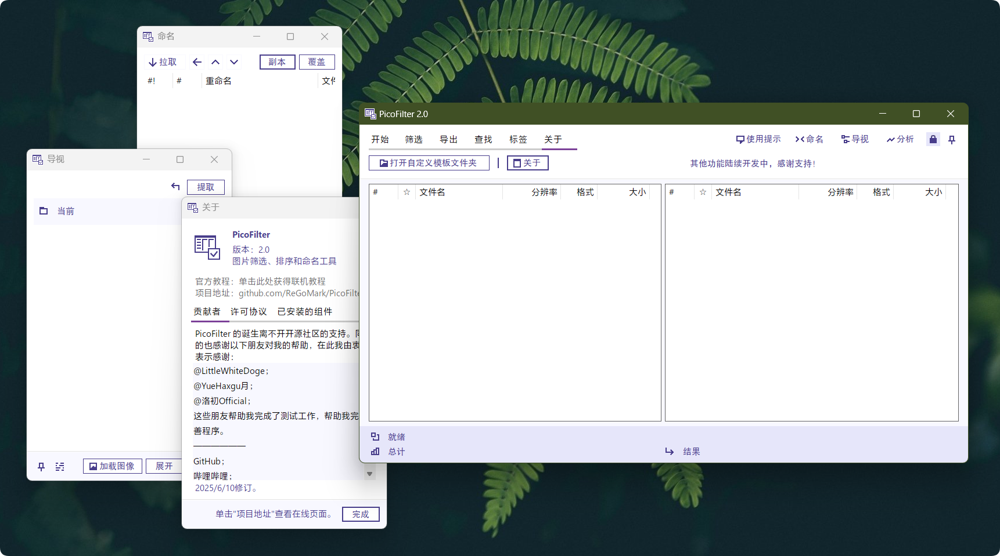
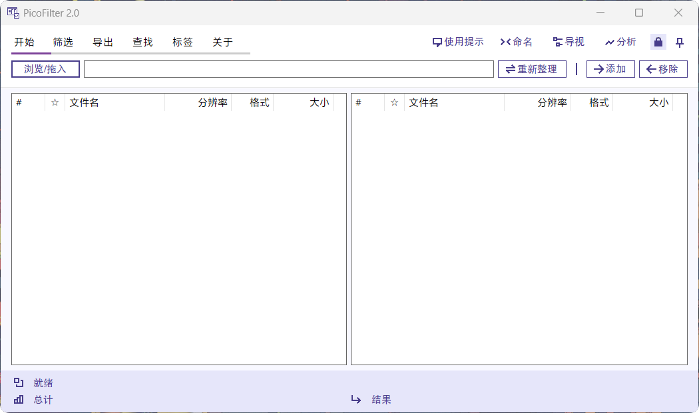
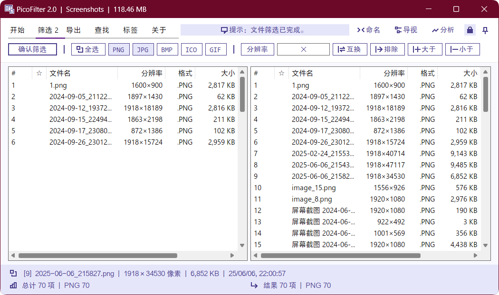
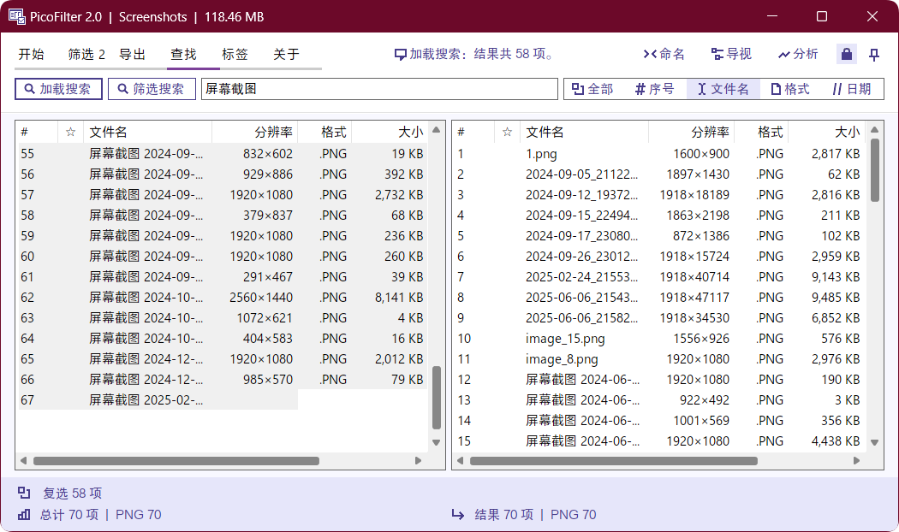
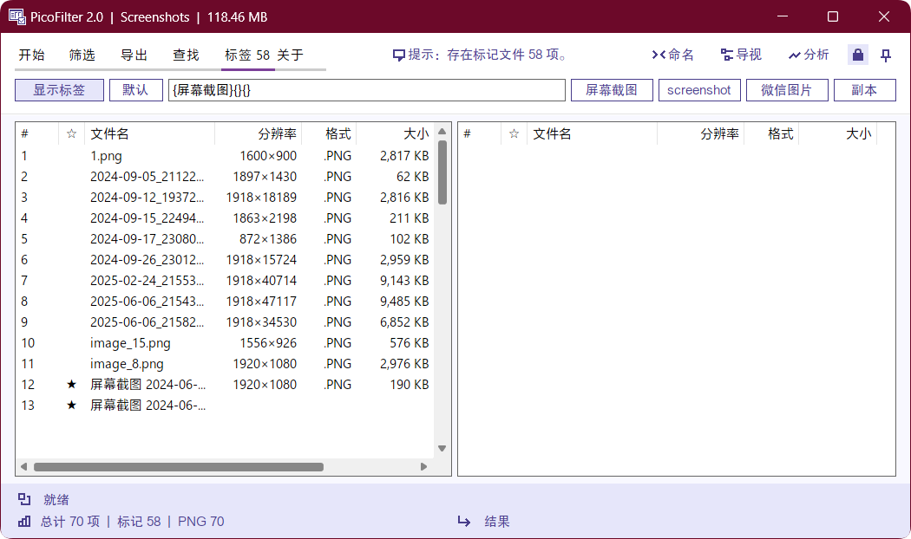

# 介绍

## 图片筛选、重命名和格式转换工具

支持常用图片格式如 `JPEG & JPG`，`PNG`，`BMP`，`ICO`，`GIF`，大约可以筛选4000张图像文件，加载时间取决于目录结构复杂程度和单文件的体积。
无论是界面设计还是运行平台均遵循标准的 `Windows` 设计规范，完全基于 `.net Framework` 的原生开发。除此之外，几乎肉眼可见的所有控件，都添加了工具提示，方便用户查看、使用。

>[!CAUTION]
>安装 [方正黑体_GBK](./Fonts/方正黑体GBK.ttf)字体提升视觉效果体验。字体文件已经附在 [Fonts 文件夹](./Fonts) 中;程序运行的最小分辨率为 `720P` ，否则可能出现布局错误问题。>
>
>本程序仅供交流和学习使用，禁止用于商业用途或未经授权的分发。

感谢开源社区的支持，没有开源社区就没有 PicoFilter 的诞生。

# 功能

1. 指定格式筛选（支持`jpg`、`bmp`、`png`、`ico`和`gif`图像，自动加载到列表中）

2. 指定分辨率筛选（`宽度`、`高度`，或者是大于设定值、等于设定值、排除设定值、小于设定值，交换宽高，甚至是交叉筛选）

3. 一键统计（自动统计分析筛选结果，轻松查看占比等信息）

4. 一键跳转（自动加载当前目录的文件夹结构，轻松跳转至上一级/下一级目录）

5. 一键导出结果（导出筛选结果为`xlsx`文件，方便统计和比对）

6. 一键整理（对筛选结果实现一键隔离、移动和复制、删除）

7. 快速搜索（支持分区搜索、全域搜索）

8. 集成鼠标功能（如鼠标中键打开当前扫描文件夹，鼠标拖拽文件夹自动扫描、鼠标中键分配列表宽度、鼠标中键填充分辨率等）

9. 标记识别（自定义标记，在加载文件时自动标记）

10. 右键菜单（支持快速筛选、快速调整工作列等功能）

11. 排序和命名（支持字符串长度、序号、分辨率总和、大小、修改日期排序，排序完成后可以批量命名，支持序号、日期、月份命名规则）

12. 格式转换（支持 `JPG`、`PNG`、`BMP`、`ICO` 格式转换为 `BMP`、`JPG`、`PNG` 格式，可选底色，可设置转换质量）

更多细节欢迎下载体验！

# 截图

# 初衷
开发初衷是针对 PAA 像素艺术大赛中的尺寸不合规、格式不合规文件进行筛选，便于后续工作的开展。因为当前社区网站还未完全建立起来，选手的投稿作品都是通过第三方网站上传，我们的收集工作也是手工从网站内下载的。对于分辨率不合规的作品，在放大的时候可能会比较模糊；同样的，PNG和JPG格式的不同，也影响了放大或展示质量。经过几个月的修修补补，现在将这款工具开放到公共视野内，欢迎大家下载交流学习使用，有任何相关的问题都可以咨询我。

# 捐赠
如果您觉得我的项目还不错，能有一点用处，欢迎您来支持一下我。

# 日志
>[!NOTE]
>+“新增”；-“删去”；~“优化”；=“修正”

## 2.0 正式版
### 2025/6/11
累计包括1.7-1.7.3的更新内容如下：

1. 修改设计风格，整体采用类RibbonUI样式，面板分三段式设计，配色更加简约现代；

2. 补充了大量图标，提供了更多的图标指示，部分按钮采用动态图标设计；

3. 新增标签功能，可以自动标记带有自定义内容的项目，并可控制是否开启，同时增加了几个快速标签的模板；

4. 新增局域搜索功能，可以快速限定搜索范围（测试）；

5. 修复大量非法操作错误，紧急修复了显示错位问题和字体缩放问题；

6. 新增在选项卡顶部的数字提示，可以快速知悉选项卡内功能状态。

* 更多功能修订请下载体验。

## 1.7
### 2025/3/6
+批量重命名功能；

~高DPI缩放导致的布局错位和字体缩放异常等问题；

=重命名工具支持独立使用（拖入文件夹）；

~一些已知问题。

## 1.6
### 2025/2/28
=若干问题；
更多更新内容请查看提交记录。

### 2025/2/19-24
+操作提示

+右键菜单

=格式和分辨率叠加筛选修正

~优化加载速度和内存占用，变相提升了可加载文件数量

~UI设计，包括进度条显示等

### 2025/2/7
+目录结构预览

=修正若干错误

~统计结果显示

-按键绑定支持

~关于窗口

~代码运行效率

+重载功能

~UI排版设计

+叠层菜单

## 1.5 
### 2024/12/23
+统计信息显示

~底部标签显示

+标题栏当前文件夹显示

+标题栏当前文件夹大小显示

=UI设计

### 2024/12/21
+忽略方向筛选

=导出表格内容

## 1.4
### 2024/12/18
~导出表格数据内容

~UI设计

+列表简易搜索功能

=按键绑定

### 2024/12/17
~UI设计

=表格导出

~结果显示

=显示错误问题

### 2024/11/26
~UI设计

+累计更新，版本号修正

~结果显示

=修改标题栏文本，

+标题栏项目扫描进度显示

### 2024/11/13
~UI设计

## 1.3
### 2024/9/28
+鼠标中键打开文件夹功能

+排除分辨率筛选

+全选按钮

+复选功能

+文件总数工具提示

+适配最大化窗口

+分隔条，自由调整两侧尺寸

=若干bug

## 1.2
### 2024/9/27
=配色方案

=图标

-对cur、ani的支持

### 2024/9/26
+对ico、bmp格式支持

+导出为xlsx功能

+调整：

+UI微调整

+对部分按钮增加了按键绑定
