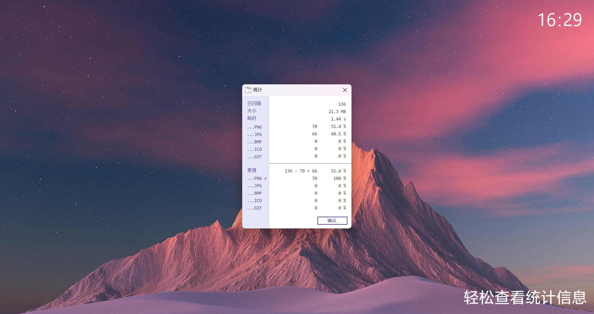
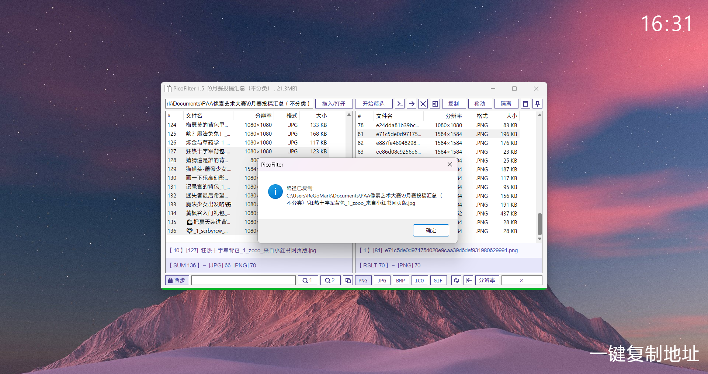
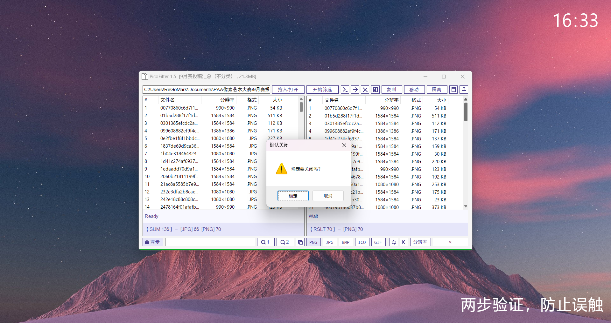

>[!CAUTION]
>注意本项目已从原有组织迁移到该公共仓库。

# 介绍

## 一款图片筛选工具，当前版本：

    

支持常用图片格式如 `JPEG & JPG`，`PNG`，`GIF`，`ICO`，`BMP`，大约可以筛选4000张图像文件，加载时间取决于目录结构复杂程度和单文件的体积。

无论是界面设计还是运行平台均遵循标准的 Win32 设计规范，完全基于 `.net Framework` 的原生开发。除此之外，几乎肉眼可见的所有控件，都添加了工具提示，方便用户查看、使用。

>[!CAUTION]
>安装 [方正黑体_GBK](./Fonts/方正黑体GBK.ttf)字体提升视觉效果体验。字体文件已经附在 [Fonts 文件夹](./Fonts) 中。
>
>缩放问题，右键单击“属性”，切换至“兼容性”选项卡，选择“更改高DPI设置”，启用“程序DPI”和“高DPI缩放替代”两个复选框。如果还是遇到了显示问题，请尝试修改部分设置。

  感谢开源社区的支持，没有开源社区就没有 PicoFilter 的诞生。

# 功能

1.指定格式筛选（支持`jpg`、`bmp`、`png`、`ico`和`gif`图像，自动加载到列表中）

2.指定分辨率筛选（`宽度`、`高度`，或者是大于设定值、等于设定值、排除设定值、小于设定值，交换宽高，甚至是交叉筛选）

3.一键统计（自动统计分析筛选结果，轻松查看占比等信息）

4.一键跳转（自动加载当前目录的文件夹结构，轻松跳转至上一级/下一级目录）

5.一键导出结果（导出筛选结果为`xlsx`文件，方便统计和比对）

6.一键整理（对筛选结果实现一键隔离、移动和复制、删除）

7.集成鼠标功能（如鼠标中键打开当前扫描文件夹，鼠标拖拽文件夹自动扫描、鼠标中键分配列表宽度、鼠标中键填充分辨率等）

8.标记识别（识别到包含“超时”“存疑”“无效”的文件名时自动标记）

9.右键菜单（支持快速筛选、快速调整工作列等功能）

10.排序和命名（支持字符串长度、序号、分辨率总和、大小、修改日期排序，排序完成后可以批量命名，支持序号、日期、月份命名规则）

更多细节欢迎下载体验！

# 截图

### 备注

>本人是强迫症患者，所以在软件排版布局上也有些考究。在两个列表之间，按下鼠标中键可以平均分配尺寸。其他的一些细微功能我都放到工具提示里面了，只要鼠标悬停就可以看得到，如在“×”位置鼠标左键双击可以自动输入宽度值。所以使用时要细心观察呐！   

>由于水平一般、能力有限，软件可能会存在内存泄漏、回收不充分的问题，不过不影响使用。
 
# 开发初衷
开发初衷是针对 PAA 像素艺术大赛中的尺寸不合规、格式不合规文件进行筛选，便于后续工作的开展。因为当前社区网站还未完全建立起来，选手的投稿作品都是通过第三方网站上传，我们的收集工作也是手工从网站内下载的。对于分辨率不合规的作品，在放大的时候可能会比较模糊；同样的，PNG和JPG格式的不同，也影响了放大或展示质量。

# 更新日志
>[!WARNING]
>由于转移仓库，Git Commit 记录已经丢失，更新日志仅供参考

>[!NOTE]
>+“新增”；-“删去”；~“优化”；=“修正”
## 1.6
### 2025/2/28
=若干问题；
更多更新内容请查看提交记录。

### 2025/2/19-24
+操作提示

+右键菜单

=格式和分辨率叠加筛选修正

~优化加载速度和内存占用，变相提升了可加载文件数量

~UI设计，包括进度条显示等

### 2025/2/7
+目录结构预览

=修正若干错误

~统计结果显示

-按键绑定支持

~关于窗口

~代码运行效率

+重载功能

~UI排版设计

+叠层菜单

## 1.5 
### 2024/12/23
+统计信息显示

~底部标签显示

+标题栏当前文件夹显示

+标题栏当前文件夹大小显示

=UI设计

### 2024/12/21
+忽略方向筛选

=导出表格内容

## 1.4
### 2024/12/18
~导出表格数据内容

~UI设计

+列表简易搜索功能

=按键绑定

### 2024/12/17
~UI设计

=表格导出

~结果显示

=显示错误问题

### 2024/11/26
~UI设计

+累计更新，版本号修正

~结果显示

=修改标题栏文本，

+标题栏项目扫描进度显示

### 2024/11/13
~UI设计

## 1.3
### 2024/9/28
+鼠标中键打开文件夹功能

+排除分辨率筛选

+全选按钮

+复选功能

+文件总数工具提示

+适配最大化窗口

+分隔条，自由调整两侧尺寸

=若干bug

## 1.2
### 2024/9/27
=配色方案

=图标

-对cur、ani的支持

### 2024/9/26
+对ico、bmp格式支持

+导出为xlsx功能

+调整：

+UI微调整

+对部分按钮增加了按键绑定
