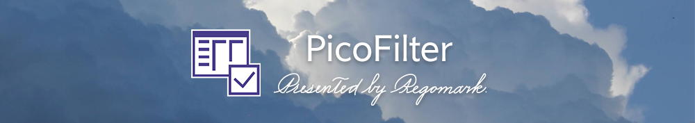

## ✒️PicoFilter - 图片筛选、重命名和格式转换工具

PicoFilter 是一款简单易用的图片整理工具，支持读取`JPEG & JPG`，`PNG`，`BMP`，`ICO`和`GIF`格式的图像文件，轻松实现`筛选分类`、`批量重命名`、`分析`和`批量格式转换`等的功能。程序基于`.NET Framework`框架开发，使用的语言为`VB.NET`，完全遵循`Windows`设计规范。

>[!TIP]
>1. 运行程序前请安装 [方正黑体_GBK](./Fonts/方正黑体GBK.ttf)字体获得最佳视觉体验。
>2. 程序必须运行在分辨率不低于`720P`的显示器上，低于该分辨率运行时会出现布局错误。
>3. 本程序完全免费开源，仅供交流和学习使用，任何人不得以任何形式用于商业用途或未经授权的分发。

 📖概览 

- [使用说明](#使用说明)  
- [特色功能](#特色功能一览)
- [界面展示](#程序界面展示)
- [下载](#下载)
- [打赏](#打赏)
- [鸣谢](#鸣谢)
- [许可协议](https://github.com/ReGoMark/PicoFilter/blob/0676005b5875f35327bca930f663c78daa085f33/LICENSE)  

## 📒使用说明

考虑到程序本身设计比较紧凑，且我对很多功能的描述不是很准确，导致很多人一上手就感到头晕。目前正在撰写`PicoFilter 2.0.2`版本的说明文档，你可以点击下方的链接来访问；此外我还在`哔哩哔哩`上传了教程视频（不过是`1.7.x`版本的，当然也可以作为参考）。如果有任何疑问欢迎联系我，我会尽我所能的帮助你。

* 说明文档 *[更新中]*：[PicoFilter 2.0.2 版本使用说明](https://flowus.cn/regmvks/e717713c-be23-4124-b364-878960e75a4e)
* 视频教程 *[1.7.x]*：[PicoFilter 1.7.x 使用教程](https://www.bilibili.com/video/BV1aR92YcEka/?spm_id_from=333.1387.homepage.video_card.click&vd_source=c4099c355c2d06f10ac210fe7bae65a6)

## 🍰特色功能一览

部分功能的名称看起来会很怪（看不懂是啥），所以我加了很多的工具提示，看不懂的功能可以优先看一下工具提示。此外我还集成了鼠标功能，如鼠标中键打开当前扫描文件夹，鼠标拖入文件夹、鼠标中键分配列表尺寸、鼠标中键填充分辨率，右键菜单等等，我不是很会描述这些功能，所以更多细节还是下载体验一下吧！
    
| 功能 | 说明 |备注|
|-----------|--------|--------|
|格式筛选|勾选任意格式（一个或多个）即可将符合项目加载到筛选列表中|可以和分辨率筛选组合使用|
|分辨率筛选|支持符合分辨率筛选、大于/小于分辨率筛选、排除符合分辨率筛选、忽略方向（不论图像方向如何）筛选|可以和格式筛选组合使用|
|分析和统计|查看当前文件夹中各个格式占比、文件夹大小、创建日期等的信息|支持导出为`Xlsx`文件|
|导视|加载当前目录下的文件夹结构，可以实现快速跳跃、返回上一级等操作|支持`拖拽`操作
|导出结果|支持隔离（将筛选结果与其他原文件分隔）、删除、移动、复制和一键保存到桌面等功能|
|搜索|可以限定搜索范围（格式、分辨率、文件名、修改日期）或者全局搜索，搜索完毕默认选中|
|星标|指定关键词（`正规则表达式`），并对带有关键词的项目添加“★”标记|**`2.0`新增**
|排序|可以对列表内项目排序，排序依据为字符串、序号、分辨率、大小、修改日期|
|批量重命名|对筛选结果批量重命名，可以自定义重命名格式（`正规则表达式`）|可独立使用|
|批量格式转换|对筛选结果批量格式转换，仅支持读取静态图像格式，转换为`JPG`、`PNG`和`BMP`格式，其中`JPG`格式可以设置转换质量，`JPG`和`BMP`可以设置背景色|可独立使用；**`2.0`新增**|

## 📷程序界面展示
* 主界面

* 筛选

* 搜索

* 星标

* 导视

* 重命名

* 格式转换

* 分析

## ⏬下载
* 发布页（优先更新）：https://github.com/ReGoMark/PicoFilter/releases
* 蓝奏云（随后更新）：https://wwza.lanzouo.com/itvJq2yqd3xc

## 💗打赏
如果你喜欢这个程序，觉得它对你有帮助，欢迎通过赞助支持作者的持续开发与维护！每一份支持，都是我继续优化和更新的动力。
无论是一次性打赏，还是持续支持，都将被深深感激！

## 🙏鸣谢
Picofilter 的诞生离不开开源社区的支持。此外，感谢 [@洛初](https://github.com/gongfuture) 对我的指导，帮助我完善了说明文档和一些`Git`相关事宜。除此之外，本程序还使用了以下组件和IDE，感谢这些开发者的辛勤付出，不胜感激。

* [MertoModernUI](https://github.com/dennismagno/metroframework-modern-ui)
* [EPPlus](https://github.com/EPPlusSoftware/EPPlus)
* [VisualStudio 2022](https://visualstudio.microsoft.com/zh-hans/vs/)

## 聊点别的
### 程序从何而来？
2024年九月份的时候，我接手了`PAA像素艺术大赛`的作品收集工作和运营工作。在此期间，选手们提交的作品很多不符合要求，使用Windows资源管理器没法快速的筛选出不符合/符合要求的文件。为此在开源社区的帮助下，我制作了这一款软件，供大赛内部使用。后来我把他继续完善，放到了Github仓库上分享给大家，一起学习和交流。在一年多的累计更新中，PicoFilter 的版本号从1.2迭代到2.0.2，新增了许许多多的功能。

